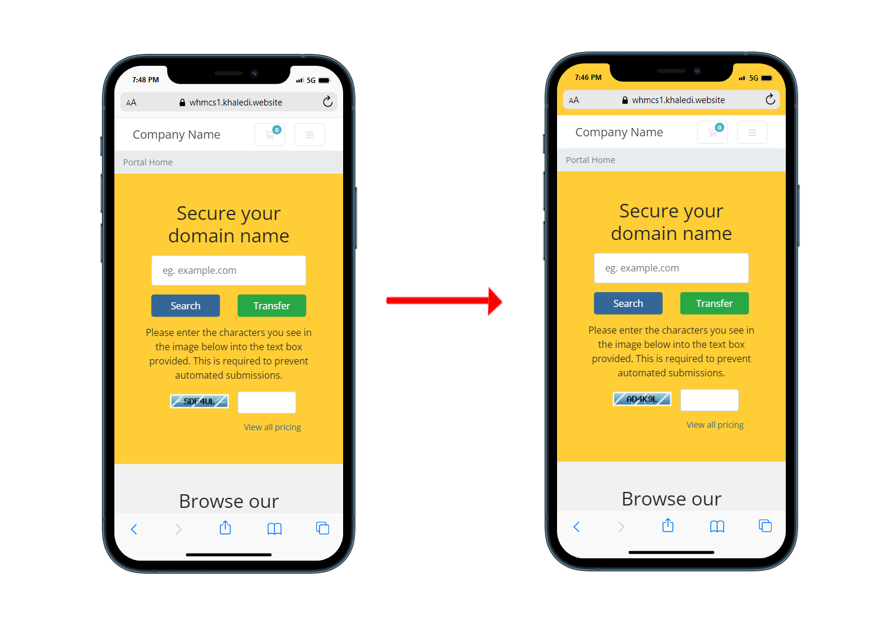
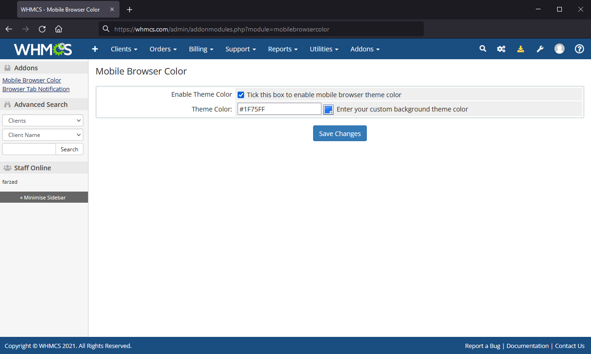

# Mobile Browser Color
Add **Mobile Browser Color** feature for mobile devices in WHMCS.

 
 

**Mobile Browser Color** Module changes color of browser search tab on mobile devices, this make feel of native app, module is simply and easy to use, please attention this browser color theme just working in mobile devices.

**Features**

- Working with WHMCS 7.x and 8.x
- Customizable color
- Without any template changes
- Working with any WHMCS templates
- Easy Installation

 

## Installation

Download addon latest version form [latest release](https://github.com/farzadkhaledi/mobilebrowsercolor/releases/latest) and extract files, then upload **mobilebrowsercolor** folder to YOUR_WHMCS_ROOT/modules/addons folder.

Then login to your WHMCS admin area and in System Settings -> Addons Modules active **Mobile Browser Color** addon.

 

## Settings

First Login to your WHMCS admin area and in top menu select Addons menu and then Mobile Browser Color item, you can setup module and set your color.

 

## Folders

<pre>
mobilebrowsercolor/
├── mobilebrowsercolor.php
├── hooks.php
├── index.php
├── whmcs.json
└── logo.png
</pre>

 

## License

All contents are licensed under the [MIT license].

[mit license]: LICENSE
